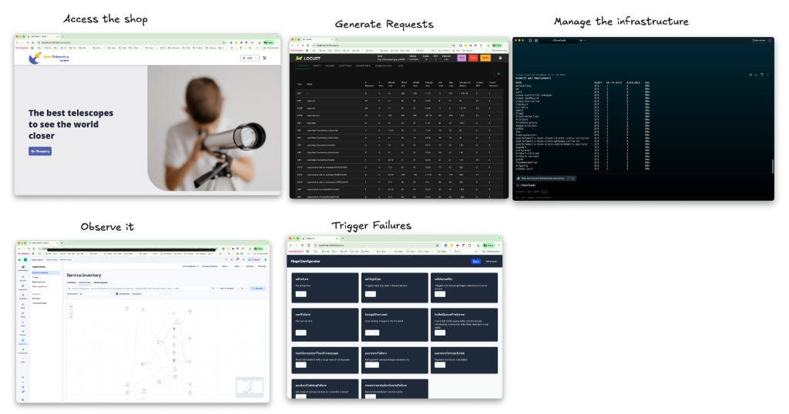
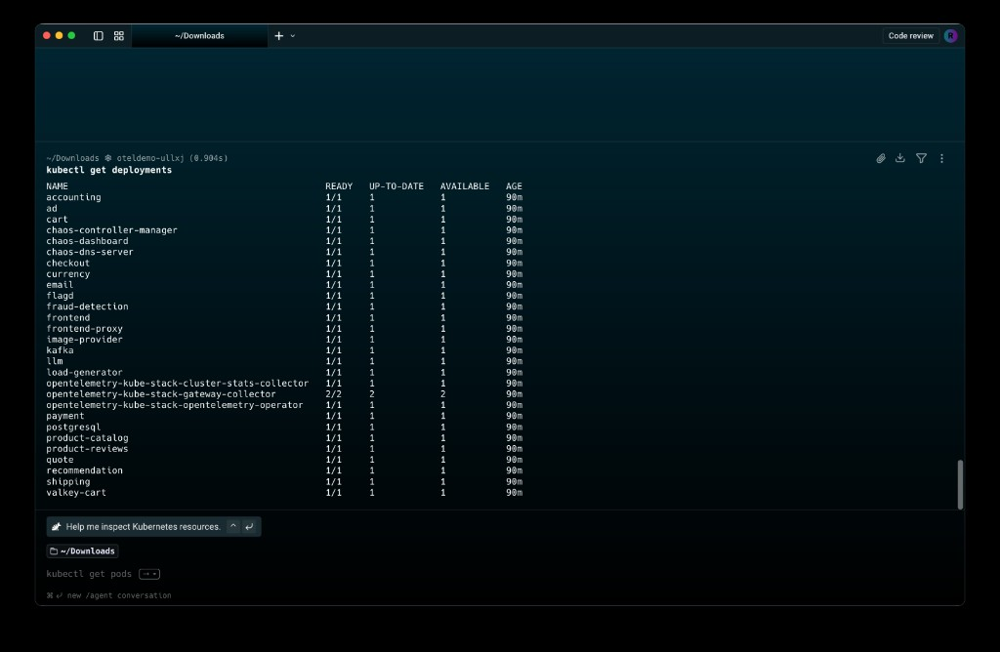

# OTel Failure Scenarios

Provision the [OpenTelemetry Astronomy Shop](https://github.com/open-telemetry/opentelemetry-demo) running on a GKE Autopilot cluster and sending data to an Elastic Cloud (ESS) cluster. Trigger failure scenarios via flagd or [Chaos Mesh](https://chaos-mesh.org/), then analyse the results in Kibana.



---

## Table of Contents

- [Prerequisites](#prerequisites)
  - [Installing oblt-cli](#installing-oblt-cli)
- [Create the Cluster](#create-the-cluster)
- [Access the Demo](#access-the-demo)
- [Managing the Kubernetes Infrastructure](#managing-the-kubernetes-infrastructure)
- [Triggering Failure Scenarios](#triggering-failure-scenarios)
  - [Method 1: flagd UI](#method-1-flagd-ui)
  - [Method 2: flagd API (curl)](#method-2-flagd-api-curl)
  - [Method 3: kubectl script](#method-3-kubectl-script)
  - [Method 4: Chaos Mesh](#method-4-chaos-mesh)
- [Failure Scenario Catalogue](#failure-scenario-catalogue)
- [Cluster Management](#cluster-management)

---

## Prerequisites

| Tool | Purpose |
|------|---------|
| [`gh`](https://cli.github.com/) | GitHub CLI — required for oblt-cli authentication |
| [`oblt-cli`](#installing-oblt-cli) | Provisions clusters and retrieves credentials |
| [`kubectl`](https://kubernetes.io/docs/tasks/tools/) | Manage the GKE cluster |
| [`jq`](https://jqlang.org/download/) | Used by `scripts/toggle-flag.sh` |

---

### Installing oblt-cli

#### Step 1 — Install GitHub CLI and authenticate

```bash
brew install gh
gh auth login
gh auth status
```

#### Step 2 — Tap and install

```bash
export HOMEBREW_GITHUB_API_TOKEN=$(gh auth token)
brew tap elastic/oblt-cli
brew install elastic/oblt-cli/oblt-cli
```

Verify:

```bash
oblt-cli --help
```

#### Step 3 — Configure (HTTP mode)

```bash
oblt-cli configure --slack-channel=@<slack_member_id> --username=<github_username> --git-http-mode
```

> **Finding your Slack member ID:** Slack profile → `⋮` menu → **Copy member ID**. It looks like `UJZTUC4HZ` — not your display name.

---

## Create the Cluster

One command creates everything:
- An ESS cluster with **Elasticsearch and Kibana**
- A **GKE Autopilot Kubernetes cluster** with the OpenTelemetry demo pre-deployed and sending telemetry to that ESS cluster

Copy the example config and set your stack version:

```bash
cp .env.example .env
# edit .env to change STACK_VERSION if needed
```

Then create the cluster:

```bash
source .env
oblt-cli cluster create custom \
  --template oteldemo \
  --parameter StackVersion=${STACK_VERSION} \
  --parameter Template=elasticsearch
```

A CI job runs (~5 minutes). When complete, **`oblt-robot-ci` sends you a Slack DM** containing:

- **Kibana URL** — open this directly in your browser to start analysing data
- **Elasticsearch URL**
- **Username and password** for Kibana login
- Your cluster name (e.g. `oteldemo-ullxj`)

You can also retrieve credentials at any time with:

```bash
oblt-cli cluster secrets credentials --cluster-name <your-cluster-name>
```

### Initialise the cluster

Run this once after configuring `kubectl` access. It resets all failure flags to off and tunes the load generator to stable settings (the template defaults cause the load generator pod to OOMKill repeatedly):

```bash
./scripts/init-cluster.sh
```

### Destroy the cluster

When you're done, tear everything down (GKE cluster + ESS deployment) with:

```bash
oblt-cli cluster destroy --cluster-name <your-cluster-name>
```

> This requires an interactive terminal — type `yes` when prompted. You'll get a Slack DM when teardown is complete (~5 minutes). See [Cluster Management](#cluster-management) for more cluster commands.

---

## Access the Demo

### Kibana — direct URL from Slack

Open the Kibana URL from the Slack message directly in your browser. No port-forwarding needed. Log in with the credentials provided.

Go to **Observability** to see traces, metrics, and logs from the OTel demo flowing in.

---

### OTel Astronomy Shop web app — kubectl port-forward required

The demo web app runs inside the GKE cluster on a `ClusterIP` service — it has no external IP. **You must port-forward to access it from your laptop.**

First configure `kubectl` (required once per session):

```bash
CLUSTER_NAME=<your-cluster-name>
oblt-cli cluster k8s --cluster-name ${CLUSTER_NAME}
```

Then start the port-forward in the background:

```bash
kubectl port-forward svc/frontend-proxy 8080:8080 &>/dev/null &
```

To stop it:

```bash
pkill -f "kubectl port-forward svc/frontend-proxy"
```

> Re-run `oblt-cli cluster k8s` if your kubectl credentials expire.

| URL | Description |
|-----|-------------|
| [http://localhost:8080](http://localhost:8080) | Astronomy Shop web store |
| [http://localhost:8080/feature](http://localhost:8080/feature) | flagd feature flag UI |
| [http://localhost:8080/loadgen](http://localhost:8080/loadgen) | Load generator UI |
| [http://localhost:8080/jaeger/ui](http://localhost:8080/jaeger/ui) | Jaeger trace UI |

---

## Managing the Kubernetes Infrastructure

Once `kubectl` is configured (via `oblt-cli cluster k8s`), you have full access to inspect and modify every workload in the cluster.



### Useful commands

```bash
# List all deployments and their status
kubectl get deployments

# List all running pods
kubectl get pods

# Describe a specific deployment (resource limits, env vars, events)
kubectl describe deployment frontend

# Scale a deployment up or down
kubectl scale deployment recommendation --replicas=0

# Restart a deployment (triggers a rolling restart)
kubectl rollout restart deployment/payment

# Edit a deployment's environment variables inline
kubectl set env deployment/load-generator LOCUST_USERS=5

# View logs for a service
kubectl logs -l app.kubernetes.io/component=checkout --tail=50 -f

# Get a shell inside a running container
kubectl exec -it deploy/frontend -- sh
```

> All commands operate against the namespace set in your current `kubectl` context. Run `kubectl config view --minify -o jsonpath='{..namespace}'` to confirm which namespace you're targeting.

---

## Triggering Failure Scenarios

### Method 1: flagd UI

1. Ensure port-forward is running
2. Open [http://localhost:8080/feature](http://localhost:8080/feature)
3. Toggle flags using **Basic View** (on/off) or **Advanced View** (raw JSON)
4. Changes take effect immediately — no restart needed

---

### Method 2: flagd API (curl)

Check the current state of any flag:

```bash
curl -s -X POST http://localhost:8080/flagservice/flagd.evaluation.v1.Service/ResolveBoolean \
  -H "Content-Type: application/json" \
  -d '{"flagKey": "productCatalogFailure", "context": {}}'
```

Response when off:
```json
{"value":false,"reason":"STATIC","variant":"off","metadata":{}}
```

Response when on:
```json
{"value":true,"reason":"STATIC","variant":"on","metadata":{}}
```

---

### Method 3: kubectl script

Check the current state of all flags:

```bash
# All flags
./scripts/list-flags.sh

# Only flags that are currently active
./scripts/list-flags.sh --active-only
```

Reset all flags to off in one go:

```bash
./scripts/reset-flags.sh
```

Use `scripts/toggle-flag.sh` to patch the flagd ConfigMap and restart the pod:

```bash
./scripts/toggle-flag.sh <flag-name> <on|off> [namespace] [release-name]
```

Examples:

```bash
./scripts/toggle-flag.sh paymentFailure on
./scripts/toggle-flag.sh paymentFailure on otel-demo my-otel-demo --variant="50%"
./scripts/toggle-flag.sh emailMemoryLeak on otel-demo my-otel-demo --variant="100x"
./scripts/toggle-flag.sh paymentFailure off
```

> flagd copies its ConfigMap to a local volume on startup and doesn't watch for changes — a pod restart is required. The script handles this automatically. See [upstream issue #1953](https://github.com/open-telemetry/opentelemetry-demo/issues/1953).

**Manual approach:**

```bash
kubectl get configmap opentelemetry-demo-flagd-config -o yaml > configmap.yml
# edit configmap.yml — change defaultVariant for the flag you want
kubectl apply -f configmap.yml
FLAGD_POD=$(kubectl get po -l app.kubernetes.io/component=flagd --output=jsonpath={.items..metadata.name})
kubectl delete "po/${FLAGD_POD}"
```

---

### Method 4: Chaos Mesh

Chaos Mesh injects infrastructure-level faults — network latency, pod kills, memory pressure, IO errors.

#### Access the Chaos Mesh UI

```bash
kubectl port-forward -n default svc/chaos-dashboard 2333:2333
```

Open [http://localhost:2333](http://localhost:2333) and create experiments via the UI.

Get your current namespace:

```bash
kubectl config view --minify -o jsonpath='{..namespace}'
```

> **Warning:** Some experiments can destabilise the cluster. Target only the specific pods you intend to affect.

#### Apply an example manifest

Pre-built experiment manifests are in `chaos-mesh/`. Replace `MY_NAMESPACE` with your cluster namespace before applying.

| Manifest | Effect |
|----------|--------|
| `chaos-mesh/network-delay-frontend.yaml` | 60ms latency on frontend every 5 min for 90s |
| `chaos-mesh/pod-kill-frontend.yaml` | Kill frontend pod every 5 min |
| `chaos-mesh/memory-stress-adservice.yaml` | Memory pressure on adservice every 5 min for 90s |
| `chaos-mesh/io-error-frontend.yaml` | 99% IO fault rate on frontend every 2 min for 90s |

```bash
# Apply
kubectl apply -f chaos-mesh/network-delay-frontend.yaml

# Remove
kubectl delete -f chaos-mesh/network-delay-frontend.yaml
```

---

## Failure Scenario Catalogue

All flagd flags default to `off`. See `flagd/demo.flagd.json` for the full flag definitions.

### Payment Failures

| Flag | `paymentFailure` |
|------|-----------------|
| **Variants** | `off`, `10%`, `25%`, `50%`, `75%`, `90%`, `100%` |
| **Affected service** | `paymentservice` |
| **What it does** | Forces the `charge` method to fail at the configured rate |
| **Kibana** | APM → Services → `checkoutservice` — error rate spike. Drill into failing traces to see the `paymentservice` span erroring. |

```bash
./scripts/toggle-flag.sh paymentFailure on
```

---

### Payment Service Unreachable

| Flag | `paymentUnreachable` |
|------|---------------------|
| **Variants** | `on` / `off` |
| **Affected service** | `checkoutservice` |
| **What it does** | Uses a bad address for `paymentservice`, simulating a network outage |
| **Kibana** | APM → Service Map — `checkoutservice → paymentservice` shows as broken. Traces show connection errors. |

```bash
./scripts/toggle-flag.sh paymentUnreachable on
```

---

### Cart Service Failure

| Flag | `cartFailure` |
|------|--------------|
| **Variants** | `on` / `off` |
| **Affected service** | `cartservice` |
| **What it does** | Returns an error on every `EmptyCart` call |
| **Kibana** | APM → Services → `cartservice` — 100% error rate on `EmptyCart`. |

```bash
./scripts/toggle-flag.sh cartFailure on
```

---

### Cart Readiness Probe Failure

| Flag | `failedReadinessProbe` |
|------|------------------------|
| **Variants** | `on` / `off` |
| **Affected service** | `cartservice` pod |
| **What it does** | Forces the readiness probe to return unhealthy — pod goes `NotReady` |
| **Kibana** | Infrastructure → Kubernetes → Pods — cart pod shows `NotReady`. |

```bash
./scripts/toggle-flag.sh failedReadinessProbe on
```

---

### Product Catalog Failure

| Flag | `productCatalogFailure` |
|------|-------------------------|
| **Variants** | `on` / `off` |
| **Affected service** | `productcatalogservice` |
| **What it does** | Returns an error for `GetProduct` requests for product ID `OLJCESPC7Z` |
| **Kibana** | APM → Services → `productcatalogservice` — errors on `GetProduct`. |

```bash
./scripts/toggle-flag.sh productCatalogFailure on
```

---

### Ad Service Failure

| Flag | `adFailure` |
|------|------------|
| **Variants** | `on` / `off` |
| **Affected service** | `adservice` |
| **What it does** | Generates an error for `GetAds` ~1/10th of the time |
| **Kibana** | APM → Services → `adservice` — intermittent errors in error rate chart. |

```bash
./scripts/toggle-flag.sh adFailure on
```

---

### Ad Service High CPU

| Flag | `adHighCpu` |
|------|-------------|
| **Variants** | `on` / `off` |
| **Affected service** | `adservice` |
| **What it does** | Triggers sustained high CPU load |
| **Kibana** | Infrastructure → Kubernetes → Pods — CPU spike on the `adservice` pod. |

```bash
./scripts/toggle-flag.sh adHighCpu on
```

---

### Ad Service Manual GC

| Flag | `adManualGc` |
|------|-------------|
| **Variants** | `on` / `off` |
| **Affected service** | `adservice` (JVM) |
| **What it does** | Triggers full manual garbage collections |
| **Kibana** | APM → Services → `adservice` — JVM metrics show GC pauses. Latency spikes correlate with GC events. |

```bash
./scripts/toggle-flag.sh adManualGc on
```

---

### Recommendation Service Cache Failure (Memory Leak)

| Flag | `recommendationCacheFailure` |
|------|------------------------------|
| **Variants** | `on` / `off` |
| **Affected service** | `recommendationservice` |
| **What it does** | Exponentially growing cache (1.4× growth, 50% of requests trigger growth) — leads to OOM |
| **Kibana** | APM → Services → `recommendationservice` — memory climbs steadily, p99 latency rises. Traces show `app.cache_hit=false` with high `app.products.count`. See the [upstream walkthrough](https://opentelemetry.io/docs/demo/feature-flags/recommendation-cache/). |

```bash
./scripts/toggle-flag.sh recommendationCacheFailure on
# Let run for ~10 minutes to observe memory growth
```

---

### Email Service Memory Leak

| Flag | `emailMemoryLeak` |
|------|------------------|
| **Variants** | `off`, `1x`, `10x`, `100x`, `1000x`, `10000x` |
| **Affected service** | `emailservice` |
| **What it does** | Simulates a memory leak at the configured multiplier |
| **Kibana** | Infrastructure → Kubernetes → Pods — RSS growth on the `emailservice` pod. |

```bash
./scripts/toggle-flag.sh emailMemoryLeak on --variant="100x"
```

---

### Kafka Queue Problems

| Flag | `kafkaQueueProblems` |
|------|---------------------|
| **Variants** | `on` / `off` |
| **Affected service** | `kafka`, `accountingservice`, `frauddetectionservice` |
| **What it does** | Overloads the Kafka queue and introduces a consumer-side delay |
| **Kibana** | APM → Services — consumer lag spike. Downstream services show increased latency. |

```bash
./scripts/toggle-flag.sh kafkaQueueProblems on
```

---

### Load Generator Homepage Flood

| Flag | `loadGeneratorFloodHomepage` |
|------|------------------------------|
| **Variants** | `on` / `off` |
| **Affected service** | All (via load generator) |
| **What it does** | Floods the homepage with requests |
| **Kibana** | APM → Services — throughput spike across all services. |

```bash
./scripts/toggle-flag.sh loadGeneratorFloodHomepage on
```

---

### Image Slow Load

| Flag | `imageSlowLoad` |
|------|----------------|
| **Variants** | `off`, `5sec`, `10sec` |
| **Affected service** | `frontend` (Envoy fault injection) |
| **What it does** | Injects a delay into product image loading |
| **Kibana** | APM → Services → `frontend` — page load latency increases. |

```bash
./scripts/toggle-flag.sh imageSlowLoad on --variant="5sec"
```

---

### LLM Rate Limit Error

| Flag | `llmRateLimitError` |
|------|---------------------|
| **Variants** | `on` / `off` |
| **Affected service** | `llmservice` |
| **What it does** | Intermittently returns HTTP 429 |
| **Kibana** | APM → Services → `llmservice` — intermittent 429 errors. |

```bash
./scripts/toggle-flag.sh llmRateLimitError on
```

---

### LLM Inaccurate Response

| Flag | `llmInaccurateResponse` |
|------|-------------------------|
| **Variants** | `on` / `off` |
| **Affected service** | `llmservice` |
| **What it does** | Returns an inaccurate product review summary for product ID `L9ECAV7KIM` |
| **Kibana** | APM → Traces — inspect spans on `llmservice` for the product ID. No error raised — correctness issue only. |

```bash
./scripts/toggle-flag.sh llmInaccurateResponse on
```

---

## Cluster Management

### Retrieve credentials

If you need to log back into Kibana or Elasticsearch, fetch your credentials at any time:

```bash
oblt-cli cluster secrets credentials --cluster-name <cluster-name>
```

### Retrieve Kibana config

Downloads a sample `kibana.yml` pre-configured for your cluster — useful if you want to run a local Kibana instance pointing at the ESS deployment:

```bash
oblt-cli cluster secrets kibana-config --cluster-name <cluster-name>
```

### Destroy the cluster

Tears down both the GKE Kubernetes cluster and the ESS (Elasticsearch + Kibana) deployment. You'll get a Slack DM when it's done (~5 minutes).

```bash
oblt-cli cluster destroy --cluster-name <cluster-name>
```

> `oblt-cli` requires an interactive terminal for the confirmation prompt — it cannot be piped. Type `yes` when asked.

You can also use the helper script (which prompts for confirmation first):

```bash
./scripts/teardown.sh <cluster-name>
```

---

## Reference

- [OpenTelemetry Demo documentation](https://opentelemetry.io/docs/demo/)
- [Feature flag reference](https://opentelemetry.io/docs/demo/feature-flags/)
- [Recommendation cache failure walkthrough](https://opentelemetry.io/docs/demo/feature-flags/recommendation-cache/)
- [oblt-cli internal docs](https://studious-disco-k66oojq.pages.github.io/tools/oblt-cli/)
- [oblt failure scenarios internal docs](https://studious-disco-k66oojq.pages.github.io/opentelemetry/failure-scenarios/)
- [Chaos Mesh documentation](https://chaos-mesh.org/docs/)
